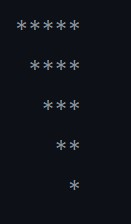
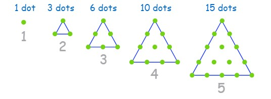

# Cpp Training

This repository contains C++ assignment labs solution for absolute beginners. It’s useful to familiarise yourself with c++ && coding in general. 

### Content 

  

* Loops
  

    * Make a right triangle using.
  
 
Output     

* Function 
    * Triangular number 

        #### Definition 

        It is simply the number of dots in each triangular pattern:   

           
        [source](https://www.mathsisfun.com/algebra/triangular-numbers.html)
          

    * Hexadecimal ( recursive ) 

        
        A recursive function converts a number given in its arguments from its decimal to hexadecimal format. 

            